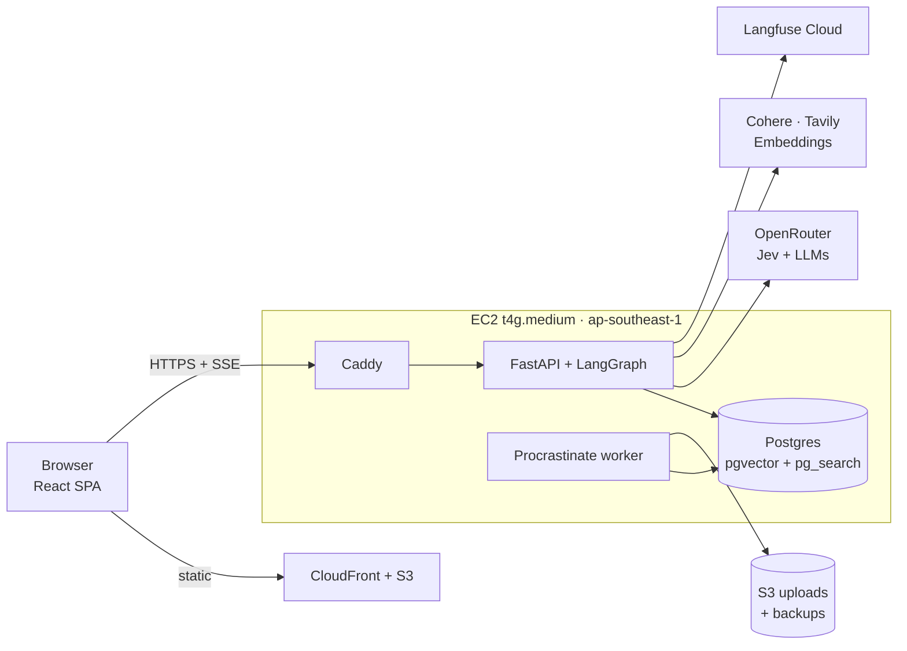
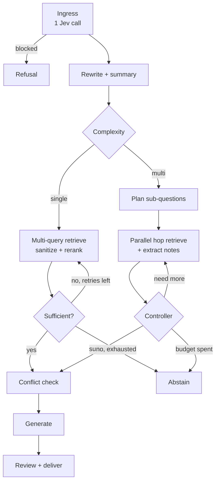

# Veriforge — Technical Requirements Document (TRD)

*Companion to `PRD.md`. See `docs/adr/` for standalone architectural
decisions and `docs/glossary.md` for terminology.*

## 6. Architecture and stack

A React SPA on CloudFront talks to one FastAPI service on a single EC2
instance, which runs the LangGraph agent in-process and uses one Postgres
for everything. All model, search and tracing services are external and
called outbound.



The API and worker are separate containers from one image; the worker
handles ingestion, evals, async scoring and starter questions.

| Layer | Choice | Notes |
| --- | --- | --- |
| Frontend | React 19, Vite, TypeScript, TanStack Router and Query, Tailwind, shadcn/ui, Zustand, Recharts | Static build; Zustand holds live run state |
| FE type safety | `@t3-oss/env-core`; hey-api openapi-ts generates client and SSE event types | CI fails if generated types drift |
| Streaming client | `@microsoft/fetch-event-source` | POST with auth header; reconnect disabled for runs |
| Backend | Python 3.12, uv, FastAPI, Pydantic v2, pydantic-settings, SQLAlchemy 2 async, asyncpg, Alembic | |
| Orchestration | LangGraph with Postgres checkpointer | Per-node streaming, cancellation, replay |
| LLM access | LiteLLM as a library | OpenRouter default; Anthropic and OpenAI direct; cost accounting |
| Decisions | Jev via OpenRouter System One API behind `DecisionEngine`; LLM fallback | Section 8 |
| Jobs | Procrastinate (Postgres queue) | No Redis |
| Database | Postgres 17, ParadeDB image: pgvector + pg_search | pg_search is AGPL; used unmodified as a service |
| Parsing | markitdown, pdfplumber fallback; OCR adapter slot | |
| Embeddings | OpenAI text-embedding-3-small (1536 dims), pinned per deployment | Re-embed job on change |
| Rerank | Cohere Rerank | Jev-score reranker is a v1.1 A/B |
| Web search | Tavily; Brave + fetch-and-clean fallback | Behind `WebSearchProvider` |
| Observability | Langfuse Cloud; app metrics in Postgres | UI never reads Langfuse |
| IaC and CI | AWS CDK (Python); GitHub Actions; ECR | arm64 images |

**Repository layout:** `apps/web`, `apps/api` (packages `graph`,
`retrieval`, `ingest`, `decisions`, `providers`, `quota`, `evals`,
`admin`), `infra/cdk`, `evals/seed`, `CLAUDE.md` at the root.

### 6.1 ADR-001: No Redis at Stage 1

**Status:** Accepted, 22 Sep 2026. Revisit when any trigger below is met.

**Decision.** Postgres provides the queue, caches, quota state and run
pub/sub. Redis is not deployed. Run streaming, cancellation, caching and
rate limiting sit behind interfaces (`RunBus`, `Cache`, `RateLimiter`)
with Postgres implementations as the default and a Redis adapter
available behind a Compose profile.

**Context.** Redis usually serves five roles in this kind of stack. Each
already has a Postgres home here:

| Role | Postgres implementation |
| --- | --- |
| Job queue | Procrastinate |
| Cache | `query_cache`, `web_cache` tables |
| Quotas and rate limits | `usage_ledger` window sums; `rate_limits` table for login |
| Sessions and run state | Stateless JWT; refresh tokens and LangGraph checkpoints in Postgres |
| Pub/sub for streams and cancel | `RunBus` on `LISTEN/NOTIFY` |

**Consequences**

- One stateful service to back up, monitor and secure; about 50–100 MB of
  RAM kept free on a 4 GB box; no ElastiCache cost.
- Cache reads take milliseconds instead of sub-millisecond, which is
  negligible next to 1–3 s model calls.
- Known `LISTEN/NOTIFY` limits accepted and designed around: each
  listening process holds one dedicated session connection; it does not
  work through PgBouncer in transaction-pooling mode; payloads cap at
  8 KB; heavy NOTIFY traffic contends on a commit-time lock. Answer deltas
  are therefore batched every 50 ms and payloads stay small.

**Triggers to add Redis**

- Sustained concurrent streams above about 200, or NOTIFY appearing in
  Postgres lock waits.
- PgBouncer introduced in transaction-pooling mode.
- Per-request rate limiting needed at high request volume.
- A semantic answer cache added to the product.

**Evidence.** Slice 8 runs the same load test with the Postgres and Redis
`RunBus` adapters and records stream latency, Postgres CPU and lock waits
in this section.

## 7. Agent graph

One LangGraph graph serves all three modes; mode and ingress decisions
choose the path. Every path ends in either a reviewed answer or an
explicit abstention.



Ingress also runs the rewrite in parallel, so the two top boxes cost one
round trip.

| Node | Engine | Behaviour |
| --- | --- | --- |
| Ingress | Jev, one call | Questions: `guard_injection`, `guard_jailbreak`, `guard_pii`, `off_topic` (noul); `intent` (choice: chitchat, lookup, compare, summarize, multi-part, follow-up); `source` (choice, if source = Auto); `complexity` (choice, if mode = Auto); `lexical_weight` (score 0–1); `risk` (choice: low, high). |
| Rewrite + summary | Small LLM | Condenses the question with history; refreshes the rolling chat summary every 10 turns. |
| Multi-query retrieve | Small LLM + SQL | 3 query variants (Auto only), each through hybrid search; results fused. Fast uses the rewritten query only. |
| Sufficient? | Jev | `sufficient` noul over question + top chunks. Below threshold with retries left (max 2): rewrite and retry. |
| Plan | Planner LLM | Streams a plan; emits 2–5 sub-questions with dependencies. |
| Hop retrieve | SQL + small LLM | Independent sub-questions run in parallel; notes extracted per hop with chunk ids kept. |
| Controller | Jev | `sufficient` / `need_more` + next sub-question type. Stops at 4 hops or the credit budget. |
| Abstain | Generator LLM | Fixed template: what was found (cited), what is missing, offers Web or Deep as buttons. |
| Conflict check | Jev | `conflict` noul across top chunks from different documents or source types. If yes, the priority rule and both citations go into the prompt. |
| Generate | Generator LLM | Streams the answer with `[n]` markers; native reasoning streamed when the model exposes it. No tools. |
| Review + deliver | Section 10 | Risk-based delivery; claim verdicts; optional single revision; output guardrail; suggestions in parallel. |

**Mode behaviour**

| Mode | Plan | Multi-query | Retry loop | Hops | Review |
| --- | --- | --- | --- | --- | --- |
| Auto | If multi | Yes | Up to 2 | If multi, up to 4 | Inline, risk-based |
| Fast | No | No | No | No | Async after delivery |
| Deep | Yes | Per hop | Via controller | Up to 4 | Inline, always verified before delivery |

**Run bus and cancellation.** Runs are decoupled from the process that
serves the browser through a `RunBus` interface (ADR-001), so any API
process can stream or cancel any run and Uvicorn can run several workers.

- `publish(run_id, event)` appends the event to `run_events`, then sends
  `NOTIFY run_<id>` carrying only `seq`; answer deltas are coalesced
  every 50 ms.
- `subscribe(run_id, after_seq)` replays from `run_events`, then
  `LISTEN`s and reads new rows by `seq`. One listener connection per
  process multiplexes all runs.
- `cancel(run_id)` sends `NOTIFY run_cancel` with the id; the process
  that owns the run cancels its `asyncio.Task`. The graph saves partial
  text with status `cancelled` and settles the ledger with actual usage.
- A run stuck in `running` with no heartbeat for 60 s is marked `failed`
  by a worker sweep.
- Adapters: `PostgresRunBus` (default) and `RedisRunBus` (Redis Streams
  plus pub/sub, Compose profile `redis`, slice 8).

## 8. Decision layer: Jev and LLM fallback

All classification, routing, scoring and verification go through one
`DecisionEngine` interface. Jev on OpenRouter is primary; a small LLM with
structured output is the fallback. The graph never knows which engine
answered.

**Interface.** `decide(state: dict | str, questions: dict[str, Question])
-> dict[str, Answer]`, where `Question` is `Noul` (yes-probability),
`Choice` (options with criteria) or `Score` (numeric range), mirroring
Jev's three types. `Answer` carries the value, probabilities or
confidence, `engine` and `latency_ms`.

**Jev engine.** Calls OpenRouter `POST /api/v1/systemone` with model
`typesafe/jev-1.13` (pinned; `jev-latest` only in eval experiments).
Several questions per call; state kept under 28K tokens to leave headroom
in the 32K window. Timeout 2 s per call.

**Fallback engine.** Haiku-class model via LiteLLM with a JSON schema
generated from the same `Question` objects. Noul asks for a probability;
Choice asks for a probability per option, normalised to sum to 1.

**Switching rules**

- Per call: a Jev error or timeout retries once on the fallback.
- Circuit breaker: 3 failures within 60 s opens the breaker; all
  decisions use the fallback for 60 s, then one probe call to Jev.
- Admin mode: `auto` (default), `jev_only`, `fallback_only`.
- Thresholds are stored per engine, so a fallback probability of 0.7 is
  not treated as a Jev 0.7.
- Every decision event carries `engine`; the trace marks fallback
  decisions.

**Shadow mode.** For a configurable sample (default 2%), the fallback
also answers asynchronously. Disagreements are stored in
`decision_shadow` and shown on the eval page.

**Decision catalogue**

| Decision | Type | Used by | Default threshold (Jev) |
| --- | --- | --- | --- |
| guard_injection, guard_jailbreak | Noul | Ingress | Block at ≥ 0.85, warn at ≥ 0.6 |
| guard_pii | Noul | Ingress | Warn at ≥ 0.7 (redact option) |
| off_topic | Noul | Ingress | Warn at ≥ 0.8 |
| intent, source, complexity, risk | Choice | Ingress | Argmax; below 0.5 confidence falls back to safe default (Both, single, high) |
| lexical_weight | Score 0–1 | Retrieval fusion | Used as weight |
| chunk_injection | Noul | Sanitizer | Drop at ≥ 0.7 |
| sufficient | Noul | Single-hop loop | Retry below 0.6; abstain below 0.35 after retries |
| controller | Choice | Deep loop | Argmax |
| conflict | Noul | Conflict check | Disclose at ≥ 0.6 |
| claim_verdict | Choice | Reviewer | See section 10 |
| output_toxicity | Noul | Output guardrail | Block at ≥ 0.85 |

All thresholds are starting points and are tuned against the seed eval
set in slice 4.

## 9. Ingestion and hybrid retrieval

Documents become heading-aware chunks with parent sections stored for
context expansion. Retrieval runs vector and BM25 search in one SQL
query, fuses with weighted RRF, reranks, then expands the winners to
their surrounding context.

### 9.1 Ingestion pipeline (worker)

1. **Accept.** Validate MIME by content sniffing, size ≤ 20 MB, SHA-256
   dedupe per collection; store the original in S3.
2. **Parse.** markitdown to markdown; pdfplumber fallback for PDFs
   markitdown fails on.
3. **Page quality.** Per page: characters per page below 200 →
   `low_text` flag (likely scanned); table cells or pipe density above a
   threshold → `table_heavy` flag. Flags surface in the Sources UI (SR-4)
   and route to OCR in v1.1.
4. **Chunk.** Split by heading hierarchy into sections (parents, ≤ 2,000
   tokens), then into children of about 500 tokens with 15% overlap. Each
   child stores `parent_id`, `ord`, `page`, `heading_path`.
5. **Embed.** Children embedded as `heading_path + text` in batches of
   100.
6. **Index.** Rows written in one transaction; document status set to
   `ready`. Starter questions for the collection are regenerated in the
   background.

**Resource limits.** Worker concurrency is 1 ingestion job at a time plus
1 light job; embedding calls are batched; the worker pauses new ingestion
jobs when more than 3 chat runs are active.

### 9.2 Retrieval query

```
WITH vec AS (top 50 by cosine distance, filtered),
     lex AS (top 50 by pg_search BM25, same filter)
fused  = Σ weight_i / (60 + rank_i)
         weight: vector = 1 − w, bm25 = w, w = lexical_weight from ingress
→ top 40 → Cohere Rerank → top 8 → dedupe adjacent → expand
```

- **Filter.** `owner_id or shared` and `collection_id in (chat
  collections)` are always injected server-side. Client filters (source
  type, document, tags, date range, MIME, page) can only narrow.
- **Multi-query.** In Auto single-hop, the original plus 3 variants run in
  parallel; lists are fused with RRF before rerank.
- **Small-to-big expansion.** Each of the top 8 children is replaced by
  its neighbours (±1 chunk) or its whole parent if the parent is ≤ 1,200
  tokens. Citations still point at the child and page.
- **Context budget.** Expanded context is trimmed to 60% of the
  generator's window minus history; the context meter reports the
  result.
- **Timeouts.** Postgres `statement_timeout` is 1.5 s for retrieval
  queries.

### 9.3 Web retrieval

Tavily search (advanced depth, 5 results) returns cleaned page content.
Pages are chunked like documents into chat-scoped temporary rows
(`source_type = web`, `chat_id` set, 7-day TTL) and pass the sanitizer.
Results are cached by normalised query for 24 h. Brave plus
fetch-and-clean is used if Tavily fails. Pinning copies the rows into a
collection.

### 9.4 Caching

Query embeddings are cached in Postgres by hash of the normalised query
text (30-day TTL). Tavily results are cached as above. Rerank results are
not cached.

## 10. Reviewer and faithfulness

The reviewer turns the answer into atomic claims, verifies each against
its cited chunks with Jev, and scores the answer by both the share of
supported claims and its weakest claim. Delivery depends on the `risk`
decision from ingress.

**Steps**

1. **Claim extraction (small LLM).** Output: list of `{claim,
   citation_ids, is_factual}`. A sentence may yield several claims.
   Non-factual text (greetings, hedges, transitions) is marked
   `is_factual = false` and skipped.
2. **Verification (Jev).** One `claim_verdict` Choice per claim:
   supported, partial, unsupported, contradicted. State = the claim plus
   its cited chunks (expanded). Claims are batched so each call stays
   under 28K tokens.
3. **Uncited claims.** A factual claim with no citation is scored
   `unsupported` without a Jev call.
4. **Scores.**
   - Faithfulness = (supported + 0.5 × partial) / factual claims.
   - Minimum claim support = the lowest P(supported) across factual
     claims.
   - Citation precision = share of citations whose chunk supports the
     claim they are attached to.
5. **Revision.** If minimum claim support < 0.5 or any claim is
   contradicted, one revision pass: the generator rewrites only the
   flagged claims using the same context, or removes them. Verification
   reruns on revised claims only. At most one revision per answer.

**Risk-based delivery**

| Risk (ingress) | Mode | Delivery |
| --- | --- | --- |
| Low | Auto | Stream answer; chips recolour as verdicts arrive; if revised, a "Reviewer revised this answer" banner with diff |
| High, or sufficiency within 0.1 of threshold | Auto | Show "Verifying…" with the trace live; deliver the reviewed answer |
| Any | Deep | Always verified before delivery |
| Any | Fast | Stream; review runs asynchronously; chips update when done |

**In parallel with review:** suggested follow-ups (small LLM, 3 questions
grounded in retrieved chunks the answer did not use) and the output
guardrail (Jev `output_toxicity`, plus a regex and Jev check for leaked
secrets or PII).

**Async scoring (worker).** Context precision, context recall (when a
reference exists) and answer relevance are computed after the run with an
LLM judge and pushed to Langfuse as scores on the trace. These do not
block the user.

## 11. Guardrails and security

Prompt injection is handled structurally first and by classifiers second;
data isolation is enforced in SQL, never by the model.

**Prompt-injection defence, in layers**

1. **Tool-less generator.** The answer model has no tools and cannot
   trigger actions, so an injected instruction can at most affect text.
2. **Delimited sources.** Each chunk is wrapped as `<source id="n"
   doc="…" page="…">…</source>`; any such tags inside chunk text are
   escaped at ingestion.
3. **Sources-are-data policy.** The system prompt states that text
   inside source blocks is evidence only and instructions in it must be
   ignored and reported.
4. **Sanitizer.** Jev `chunk_injection` on every retrieved chunk and web
   page; dropped chunks show in the Sources tab.
5. **Ingress checks.** Jev injection and jailbreak checks on the user
   message.
6. **Reviewer.** Claims that follow instructions rather than evidence
   fail verification.

**Other guardrails:** PII in the user message (warn or redact, admin
choice), off-topic (warn), output toxicity (block), secret and PII
leakage in output (redact). PII in the user's own documents is not
blocked.

**Authentication and sessions**

- Passwords hashed with argon2id; login and signup rate-limited per IP
  and per email.
- Access JWT (15 min) in memory; refresh token (30 days, rotating,
  revocable) in an httpOnly, Secure, SameSite=Strict cookie.
- Google OAuth via authorization code with PKCE.
- Email verification and password reset through SES (SES sandbox is
  enough at demo scale).

**Authorisation and data isolation**

- Roles: `user`, `admin`, `demo` (read-only, shared collections only).
- Every repository function takes the acting user and adds ownership
  filters; retrieval filters are built server-side (section 9.2).
- Admin routes behind a role dependency; all admin writes go to
  `audit_log`.

**Secrets and data protection**

- Provider API keys encrypted with Fernet; the key lives in SSM
  Parameter Store (SecureString) and loads at startup.
- No secrets in images or the repository; `pydantic-settings` and
  `@t3-oss/env-core` fail startup on missing values.
- Uploads in a private S3 bucket with SSE-S3; presigned URLs expire in
  5 minutes.
- CORS limited to the app origin; security headers set in Caddy (HSTS,
  CSP, X-Content-Type-Options).

## 12. API and streaming contract

The API is REST plus one SSE stream per run. The OpenAPI schema is the
single source of truth: the TypeScript client and the SSE event union are
generated from it.

**Main endpoints**

| Method and path | Purpose |
| --- | --- |
| `POST /auth/signup`, `/auth/login`, `/auth/refresh`, `/auth/logout`, `GET /auth/google/*` | Authentication |
| `GET/POST/PATCH/DELETE /chats`, `GET /chats/{id}/messages` | Chat management |
| `POST /chats/{id}/runs` | Start a run: `{message, mode, source, model_id, collection_ids, filters}` → `{run_id}` |
| `GET /runs/{id}/stream` | SSE event stream (live or replay from `run_events`) |
| `POST /runs/{id}/cancel` | Cancel |
| `POST /messages/{id}/feedback` | Thumbs and comment |
| `GET/POST/PATCH/DELETE /collections`, `POST /collections/{id}/documents`, `GET /documents/{id}/chunks` | Sources |
| `POST /web-sources/{id}/pin` | Pin a web page into a collection |
| `GET /me/usage`, `GET /me/quota` | Usage and quota |
| `/admin/providers`, `/admin/models`, `/admin/roles`, `/admin/settings`, `/admin/plans`, `/admin/users`, `/admin/evals/*`, `/admin/audit` | Admin (role `admin`) |

**SSE events** (Pydantic discriminated union on `type`; every event has
`run_id`, `seq`, `ts`)

| Event | Payload |
| --- | --- |
| `run.started` | mode, source, model, settings version |
| `step.started` / `step.completed` | node, label, duration_ms |
| `decision` | name, value, probabilities or score, engine, latency_ms |
| `plan` | steps and sub-questions |
| `thinking.delta` | native reasoning text |
| `retrieval` | hop, query, chunks with vector, bm25, fused and rerank scores, dropped flag |
| `answer.delta` | text |
| `answer.hold` | reason (verifying) |
| `review.claim` | claim id, text, citation ids, verdict, p_supported |
| `revision` | revised text, diff |
| `abstain` | found summary, missing summary, offered actions |
| `conflict` | citation ids on each side, rule applied |
| `suggestions` | 3 questions |
| `metrics` | latency by stage, tokens in and out, credits, context used and window, faithfulness, min support |
| `heartbeat` | every 15 s |
| `run.completed` / `run.cancelled` / `run.failed` | final status, error code |

Events flow through the `RunBus` (section 7): the stream endpoint replays
from `run_events`, then follows live notifications, so it works from any
API process and resumes after a dropped connection with `?after_seq=`.
Caddy is configured with `flush_interval -1` so events are not buffered.

## 13. Data model

All state lives in one Postgres database: app tables, vectors, BM25
index, LangGraph checkpoints and the job queue. Primary keys are UUIDv7;
every table has `created_at`.

| Table | Key columns | Notes |
| --- | --- | --- |
| `users` | email, password_hash, role, plan_id, status | role: user, admin, demo |
| `oauth_accounts` | user_id, provider, subject | |
| `refresh_tokens` | user_id, hash, expires_at, revoked_at | Rotating |
| `plans` | name, credits_5h, credits_month | Defaults 200k and 2M |
| `user_quota_overrides` | user_id, credits_5h, credits_month | Nullable fields |
| `collections` | owner_id, name, visibility, starter_questions jsonb | visibility: private, shared |
| `documents` | collection_id, name, mime, sha256, s3_key, status, page_flags jsonb, error | status: queued → ready or failed |
| `sections` | document_id, heading_path, text, tokens | Parents for small-to-big |
| `chunks` | document_id, section_id, ord, page, text, embedding vector(1536), metadata jsonb, source_type, chat_id, expires_at | HNSW index on embedding; pg_search BM25 index on text; GIN on metadata |
| `query_cache` | query_hash, embedding, created_at | 30-day TTL |
| `web_cache` | query_hash, results jsonb | 24 h TTL |
| `chats` | user_id, title, pinned, model_id, collection_ids, summary | |
| `messages` | chat_id, role, content, status, revised_from | status: complete, cancelled, abstained, failed |
| `runs` | message_id, mode, source, settings_version, metrics jsonb, langfuse_trace_id | |
| `run_events` | run_id, seq, type, payload jsonb | Replay |
| `citations` | message_id, n, chunk_id, rerank_score, verdict, p_supported | |
| `claims` | message_id, text, citation_ns, verdict, p_supported, engine | |
| `feedback` | message_id, user_id, rating, comment | |
| `usage_ledger` | user_id, run_id, model, role, tokens_in, tokens_out, credits, status, ts | status: reserved, settled; index (user_id, ts) |
| `llm_providers` | name, kind, base_url, api_key_enc, enabled | |
| `models` | provider_id, model_id, price_in, price_out, context_window, capabilities jsonb, enabled | |
| `model_roles` | role, model_id, fallback_model_id | |
| `settings` | version, data jsonb, created_by, active | Versioned; one active |
| `decision_shadow` | run_id, decision, jev_answer, fallback_answer, agree | |
| `eval_datasets`, `eval_items`, `eval_runs`, `eval_results` | dataset, question, reference answer, expected citations, should_abstain; run config and per-item scores | |
| `audit_log` | actor_id, action, target, before, after | |

LangGraph checkpoint tables and Procrastinate tables are created by their
libraries in separate schemas (`graph`, `queue`). A nightly job deletes
expired web chunks and cache rows.

## 14. Quotas and credit accounting

Credits are cost-weighted tokens, counted on every model call in a run,
checked before the run and settled after it.

```
credits = (p_in · t_in + p_out · t_out) / p_ref
```

Here p is the model's price per token and p_ref is the input price of the
reference model (Haiku-class), so one credit is about one reference input
token. Jev calls use Jev's price and are close to zero.

**Flow**

1. **Gate.** On `POST /runs`, sum `usage_ledger.credits` where `ts > now()
   - 5 hours` and where `ts` is in the current calendar month (UTC).
   Reject with 429 and `reset_at` if either sum plus the mode's estimate
   exceeds the limit.
2. **Reserve.** Insert a `reserved` row with the estimate (Fast 3k, Auto
   8k, Deep 30k credits by default; admin-editable). This stops parallel
   runs from overspending.
3. **Meter.** Each model call adds its actual credits to the run total
   from LiteLLM usage data.
4. **Settle.** At run end (any status), replace the reservation with one
   `settled` row holding the actual total.
5. **Deep budget.** Deep runs stop hopping when actual credits reach the
   lesser of the per-run cap (default 40k) and the user's remaining
   5-hour allowance.

**Reset times.** The 5-hour reset shown to users is the time the oldest
ledger row in the window leaves it; the monthly reset is the first of
next month (UTC).

**Performance.** An index on `(user_id, ts)` keeps the window sums under
a few milliseconds at expected volume; no counters table is needed at
Stage 1.

## 15. Evals and observability

Quality is gated by evals from slice 3 onward; runtime behaviour is
traced in Langfuse, and the metrics the UI shows come from Postgres.

**Seed eval set (ships in slice 3).** 50 hand-labelled questions over the
demo corpus, stored in `evals/seed` and loaded into `eval_items`:

| Category | Count | Checks |
| --- | --- | --- |
| Single-document lookup | 15 | Faithfulness, context recall, citation precision |
| Multi-hop across documents | 10 | Same, plus hop count and cost |
| Keyword-heavy (codes, part numbers) | 5 | BM25 contribution, recall |
| Conflicting sources | 5 | Conflict disclosed, both sides cited |
| Should abstain | 10 | Correct abstention, no fabricated answer |
| Injection in document text | 5 | Instruction ignored, chunk flagged |

**Eval runs.** An eval run executes each item through the real graph with
a chosen settings version and mode, then records faithfulness, minimum
support, citation precision, context precision and recall, answer
relevance (LLM judge), abstention correctness, latency and credits. Runs
are compared against a baseline with per-item diffs, and pushed to
Langfuse as experiments.

**Dataset sources.** Hand-written; synthetic (an LLM drafts Q&A pairs from
sampled chunks, an admin approves each); harvested from rated chats
(thumbs-down answers become candidate items).

**Gates in CI.** A 20-item fast subset runs on every merge to `main` that
touches `graph`, `retrieval`, `decisions` or prompts. The merge fails if
faithfulness drops by more than 0.03, abstention accuracy by more than
5 points, or p50 latency rises by more than 20% against the stored
baseline.

**Tracing.** The Langfuse LangGraph callback traces every run with node
spans, model calls, tokens and cost; decision calls appear as spans with
their probabilities. Reviewer scores, user feedback and async judge
scores are attached as Langfuse scores. Trace sampling is an admin
setting (default 100%, lower if the free tier limit is near).

**App metrics.** `runs.metrics` stores latency by stage, tokens, credits,
context use and scores per run; the usage page and admin dashboards
aggregate these with SQL. Structured JSON logs go to CloudWatch Logs with
7-day retention.

## 16. Deployment, infrastructure and cost

Stage 1 runs on one t4g.medium in ap-southeast-1 for about $39 per month
of AWS infrastructure, with a scripted path to Stage 2 when traffic
justifies it. Prices are approximate on-demand list prices as of
September 2026; confirm in the AWS Pricing Calculator.

**Stage 1 components**

- EC2 t4g.medium (2 vCPU, 4 GB), Amazon Linux 2023 arm64, 30 GB gp3, one
  Elastic IP.
- Docker Compose: `caddy`, `api`, `worker`, `postgres` (ParadeDB image).
  Postgres data on the EBS volume.
- SPA on S3 behind CloudFront; API on `api.<domain>` via Caddy with
  automatic TLS.
- Secrets in SSM Parameter Store; instance role grants read access to
  its parameters, the uploads bucket and ECR.
- Backups: nightly `pg_dump` to S3 (30-day lifecycle) and daily EBS
  snapshots through Data Lifecycle Manager (7 retained).
- CI/CD: GitHub Actions builds arm64 images, pushes to ECR, runs
  migrations and deploys through SSM Run Command (`docker compose pull
  && up -d`). SPA deploys by S3 sync and CloudFront invalidation.
- CDK stacks: `network` (default VPC, security group 80/443 only),
  `data` (S3 buckets, DLM), `app` (instance, role, EIP), `edge`
  (CloudFront, Route 53, ACM).

**Monthly AWS cost (Stage 1)**

| Item | Assumption | Per day | Per month |
| --- | --- | --- | --- |
| EC2 t4g.medium | $0.0424/h on-demand | $1.02 | $30.95 |
| EBS gp3 | 30 GB | $0.09 | $2.88 |
| Public IPv4 | $0.005/h | $0.12 | $3.65 |
| Snapshots, S3, ECR | ~10 GB, ~10 GB, ~2 GB | $0.03 | $1.00 |
| Route 53 | 1 hosted zone | $0.02 | $0.50 |
| CloudFront, data out, SSM, ACM | Within free allowances | $0.00 | $0.00 |
| **Total** | | **$1.28** | **$38.98** |

A t4g.small brings the total to about $23.50 for a quiet demo; a 1-year
Savings Plan on t4g.medium to about $27–29. Model, rerank, embedding and
search usage are billed by their providers and capped by quotas.

**Stage 2 (trigger: sustained CPU above 60% or more than 20 concurrent
runs).** API and worker move to ECS behind an ALB; Postgres moves to its
own EC2 instance, not RDS, because RDS does not support pg_search.
Estimated $90–130 per month.

**Recovery.** Restore runbook: launch from the latest snapshot or a fresh
instance, restore the latest `pg_dump`, repoint the Elastic IP. Target
30 minutes, tested once before launch.

## 17. Build plan (Claude Code slices)

The build is ten vertical slices, each merged, deployed and demoable
before the next starts. From slice 3, each slice must also pass the eval
gate in section 15.

| Slice | Delivers | Acceptance criteria | Requirements |
| --- | --- | --- | --- |
| 0. Foundation | Monorepo, uv and pnpm, Compose, settings on both sides, OpenAPI codegen, CI, `CLAUDE.md` with conventions and the SSE contract | `docker compose up` gives a healthy API, DB and SPA; CI runs lint, types and tests | — |
| 1. Auth and streaming chat | Signup, login, Google OAuth, chat CRUD, plain LLM streaming over the SSE contract via `PostgresRunBus`, cancel, model picker, Langfuse, first AWS deploy | A signed-in user streams an answer on the deployed URL with 2 Uvicorn workers; stream and cancel work from either worker; replay and resume work; trace visible in Langfuse | AC-1, AC-2, CH-5, CH-6, CH-8 |
| 2. Ingestion and sources | Collections, upload, parse, page flags, chunking with sections, embedding, BM25 index, Sources page, worker limits | 50-page PDF ready in under 2 min; flags shown; chat latency unaffected during ingestion | SR-1–SR-4 |
| 3. Retrieval and Fast mode | Hybrid SQL, filters, rerank, small-to-big, citations UI, seed eval set, eval runner CLI | Fast mode answers with hover citations; seed set baseline stored; ownership-filter tests pass | SR-6, TR-1, TX-2 |
| 4. Decision layer and Auto | `DecisionEngine` (Jev + fallback, breaker, shadow), ingress, sanitizer, structural injection defence, web search, multi-query, fusion weights, retry loop, abstention, conflict check, Trace panel | Auto meets section 5 latency; abstention ≥ 80% on the seed set; injection items pass | CH-1, CH-2, TR-4, TR-5, TX-1, SR-5 |
| 5. Deep mode | Planner, parallel hops, controller, notes, native thinking stream, Deep budget | Multi-hop seed items beat Auto on faithfulness and recall; p50 under 30 s | CH-4 |
| 6. Reviewer and trust UI | Claim extraction, Jev verification, scores, revision, risk-based delivery, output guardrail, suggestions, metrics and context UI | Faithfulness ≥ 0.90 on the seed set; chips recolour live; revision diff shown | TR-2, TR-3, TR-6, TR-7, CH-9, TX-3, TX-4 |
| 7. Quotas and admin | Ledger, gate, reserve and settle, quota meter; all admin pages, versioned settings, audit log | Parallel runs cannot exceed limits; settings rollback works | AC-3–AC-6, AD-1–AD-6, AD-8, AD-9 |
| 8. Evals page, demo and hardening | Eval page with datasets, synthetic generation, harvest, run diffs; demo corpus and account; usage page; restore test; security review; `RedisRunBus`, Redis cache and rate-limiter adapters behind Compose profile `redis`; load test of both buses | Restore under 30 min; demo account read-only; all section 5 targets met; the same test suite passes on both buses; load-test results recorded in ADR-001 | AD-7, TX-5, TX-6, CH-7, CH-10 |
| 9. OCR (v1.1) | OCR adapter behind toggle for `low_text` pages; Jev reranker A/B | Scanned PDF answers cite the right page | — |

**Working agreement for Claude Code**

- Start each slice from a short plan in the PR description that lists the
  requirement IDs it covers.
- Tests first for the retrieval SQL, quota gate and ownership filters;
  these are the riskiest correctness code.
- Prompts live in `apps/api/prompts/*.md` with a version header, so eval
  diffs can name the prompt change.
- Never edit generated TypeScript by hand; change the Pydantic model and
  regenerate.

## 18. Risks and open questions

The largest risk is dependence on Jev while it is in beta; the fallback
engine and per-engine thresholds contain it.

| Risk | Impact | Mitigation |
| --- | --- | --- |
| Jev beta: outages, API changes, price changes | Decisions slow or fail | `DecisionEngine` fallback, circuit breaker, pinned model version, shadow-mode agreement tracking |
| Jev calibration unknown on this domain | Wrong routing or guardrail thresholds | Thresholds tuned on the seed set; per-engine thresholds; eval gate in CI |
| Jev 32K context limit | Reviewer batches can overflow | State kept under 28K; claims batched |
| Single-box failure | Downtime up to restore time | Nightly dumps, daily snapshots, tested 30-minute runbook |
| RDS lacks pg_search | Blocks a later move to managed Postgres | Stage 2 uses self-managed Postgres on EC2 |
| Langfuse free-tier limits | Tracing gaps | Admin trace sampling; UI metrics come from Postgres |
| Reviewer adds latency on high-risk answers | Slower answers | Risk-based delivery; Fast mode; latency budgets in CI |
| Classifier guardrails miss attacks | Injected behaviour | Structural defences first; tool-less generator |

**Open questions**

- Demo corpus: which public document set (for example AWS whitepapers) is
  licensed for this use?
- Domain name and email sender for verification and reset emails.
- Should the demo account use a stricter quota plan and a cheaper model
  only?
- Default answer model for Auto: a mid-tier model via OpenRouter, or a
  direct Anthropic model?

**Sources**

- [TypeSafe: Introducing System One Models and Jev](https://typesafe.ai/blog/introducing-system-one-models-and-jev)
- [OpenRouter: TypeSafe SDK and System One API](https://openrouter.ai/docs/guides/community/typesafe-sdk.md)
- [OpenRouter: Jev 1.13 model page](https://openrouter.ai/typesafe/jev-1.13)
- [Spare Cores: t4g.small regional pricing](https://sparecores.com/server/aws/t4g.small)
- [instance-pricing.com: t4g.medium regional pricing](https://www.instance-pricing.com/provider=aws-ec2/instance=t4g.medium)