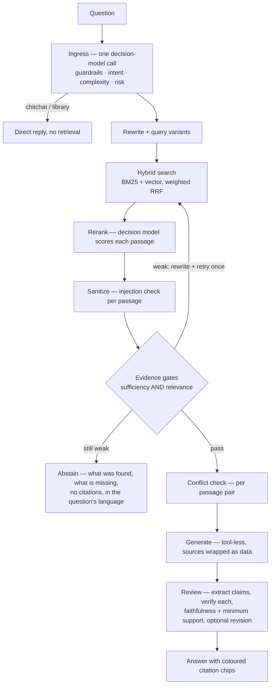
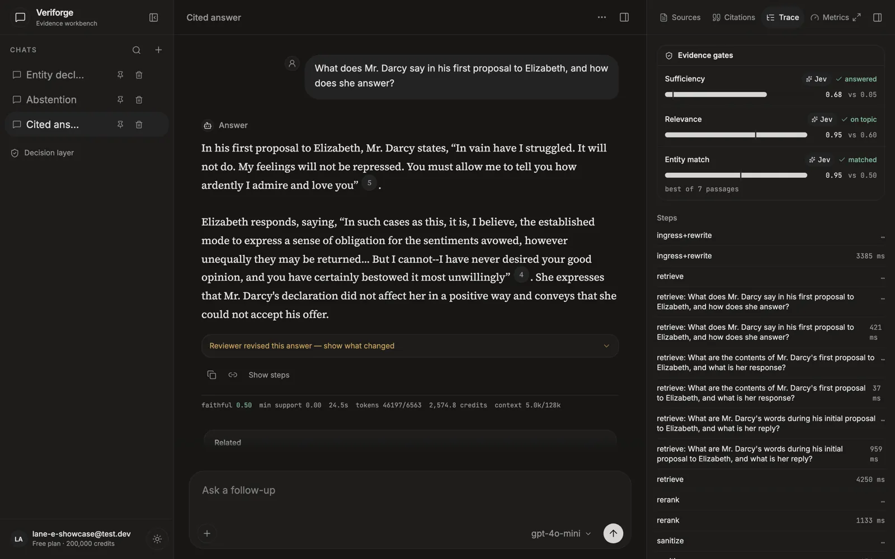
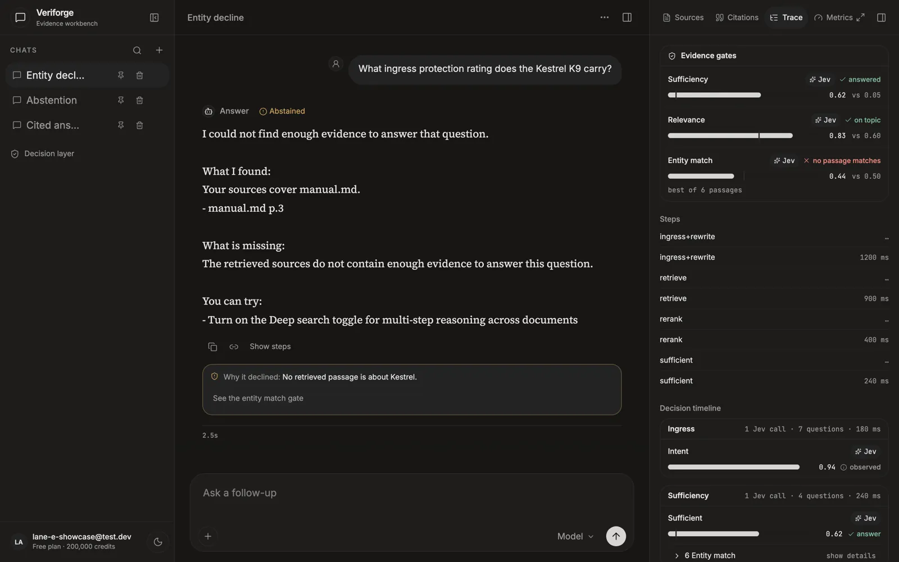
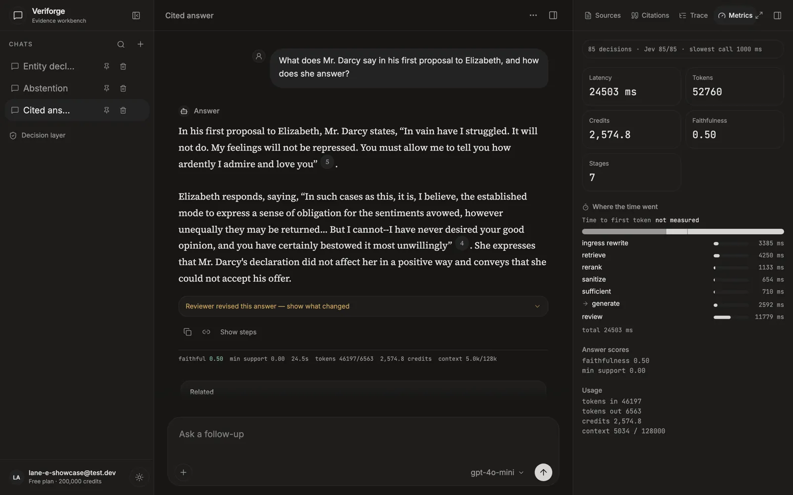
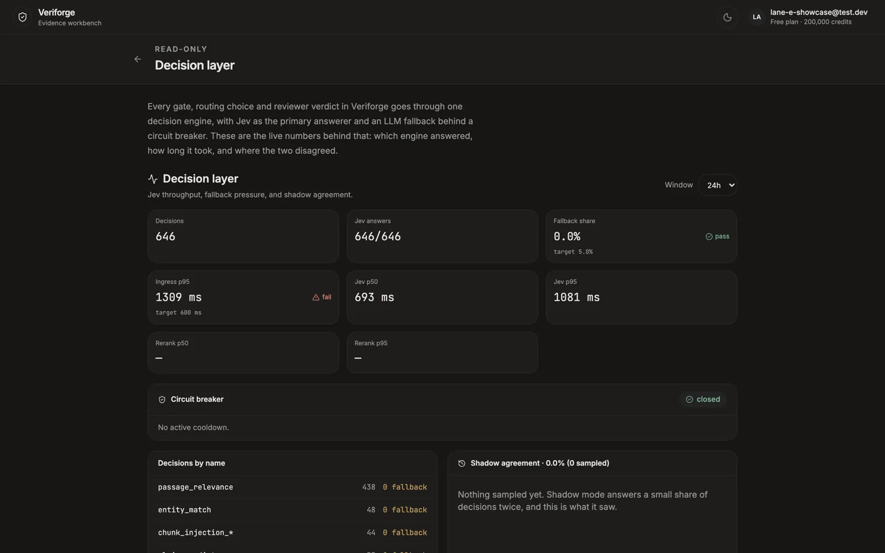

# Veriforge: a RAG system that shows its work

Veriforge answers questions from your documents and the web with **inline
citations, per-claim verification and an explicit "I don't know"**, and it
streams every decision it makes while it works. It's built production-shaped:
multi-user accounts, quotas, an admin console, versioned settings, an eval
gate in CI, and a written record of every decision and defect.

> **Status (2026-10-02).** Core RAG, trust layer, eval gate and multilingual
> support are built and merged. OKF support and the latency work are planned
> (see [Roadmap](#roadmap)). Every number on this page carries the date it
> was measured. Where something isn't measured yet, it says so.

---

## What's different from a typical RAG demo

| | Typical RAG demo | Veriforge |
| --- | --- | --- |
| **Retrieval** | Vector search | Hybrid BM25 + vector search fused with weighted RRF, reranked, expanded small-to-big; multi-query and multi-part splitting |
| **Trust** | Citations, maybe | Claim-level verification, faithfulness and minimum-support scores, risk-based delivery, conflict disclosure, **abstention with no fabricated citations** |
| **Decisions** | `if` statements or one LLM call | Every routing, scoring and verification step goes through a **decision model** (Jev), with an LLM fallback, a circuit breaker and shadow mode |
| **Evaluation** | None, or a notebook | A seed set and an acceptance set, a baseline built from 5 runs, a **CI eval gate**, attribution of provider time vs our overhead |
| **Languages** | English | 7 languages; the reply follows the question's language |
| **Engineering** | Single user | Multi-user, credit quotas with reserve/settle, admin with audit log, a resumable SSE run stream |
| **Process** | README | PRD, TRD, ADRs, conventions, and a known-issues log with evidence for every entry |

---

## How an answer is made

**Auto** mode is single-hop with multi-query and one retry. **Deep** mode plans
sub-questions and runs multi-hop retrieval under a controller. Every box
publishes its step and decision, with probabilities, to the live **Trace
panel**.

**Stack:** FastAPI + LangGraph, Postgres with pgvector and ParadeDB
`pg_search` (ICU tokenizer for CJK), Procrastinate workers, React + TanStack
Query, OpenRouter models, `text-embedding-3-large` at 1536 dimensions.

---

## Why a decision model

Retrieval, routing and verification involve many small judgements: is this
passage relevant, is the evidence sufficient, does this claim follow from that
source, which intent is this? Veriforge sends **every one of them** through one
`DecisionEngine` interface, backed by **Jev**, a decision model, with an LLM
fallback. It never makes ad-hoc LLM calls for them.

What that buys, measured:

| | Jev | NVIDIA reranker | Measured |
| --- | --- | --- | --- |
| Answer text kept in the top 8 | **1.00** | 0.82 | 2026-09-30, 23 items |
| Recall@8 | 1.00 | 1.00 | 2026-09-30 |
| Rerank p50 latency | **431 ms** | 839 ms | 2026-09-30 |
| Cost per query | ~$0.0006 | free tier (not production-licensed) | 2026-09-30 |

And the engineering it demands:
- **Thresholds are per engine.** A fallback 0.7 isn't a Jev 0.7.
- **A circuit breaker** (3 failures in 60 s) moves decisions to the fallback,
  then probes Jev again. **Shadow mode** records the fallback's answer on a 2%
  sample, to measure agreement.
- **Calibration is evidence-based.** The relevance gate's floor (0.60) was
  fitted from measured separation: every should-answer item scored ≥ 0.70 and
  every should-abstain item ≤ 0.52, in both runs.
- **Where it misfired, and what we learned.** A borderline intent score
  routed "What does the package contain?" to the "list my documents" path in
  2 of 3 runs. Fix: a confidence floor for that route and a clearer criterion.
  Now 0 of 10.

---

## OKF and RAG: better together *(planned, ADR-004)*

[Google's Open Knowledge Format](https://github.com/GoogleCloudPlatform/knowledge-catalog)
(v0.2) is a bundle of markdown concept files with frontmatter, links between
concepts, and trust signals: who generated it, who verified it, its status
and when it goes stale.

**OKF doesn't replace RAG.** It's only a format. It has no search, no ranking,
no verification and no generation. Something still has to find the right
concept, check it answers the question, and write a cited reply. That's RAG.

| | RAG alone | OKF alone | Together |
| --- | --- | --- | --- |
| Finding information | Hybrid search over chunks | None | One search over documents **and** concepts |
| Structure | Inferred from text | Explicit links | Links followed in Auto (1 hop) and Deep (a decision-model choice), **inside scope only** |
| Trust | Claims checked after generation | Declared by the author | Deprecated excluded, stale flagged, human-verified preferred, status breaks conflict ties |
| Coverage | Any document | Only curated concepts | Curated knowledge where it exists, raw documents everywhere else |
| Output | A chat answer | — | **Verified answers exported as OKF concepts**, reusable by other systems and agents |

It's a loop: documents feed answers, verified answers become concepts, and
concepts improve later answers.

One guardrail: **trust signals change ranking only, after the evidence checks,
and a link never widens what a user can access.** A "verified" label can't
make an unsupported answer pass.

---

## Evaluation: measured, not asserted

Two sets, two purposes:
- **Seed set:** 63 items, mostly over a fictional product's manuals, in 6 categories (lookup,
  multi-hop, keyword-heavy, conflicting sources, should-abstain, injection in
  the document text). Its **fast20** subset gates every relevant merge in CI.
- **Acceptance set:** 48 items over 11 public-domain books in 7 languages,
  covering answer, decline, small talk and library questions.

### Scorecard

| Metric | Value | Measured | Notes |
| --- | --- | --- | --- |
| Faithfulness (fast20) | **0.976** mean of 5 runs (range 0.964–1.000) | 2026-10-02 | Share of claims the reviewer finds supported by their citations |
| Abstention, should-abstain items (fast20) | 7 / 8 | every run since 2026-10-01 | — |
| Answer rate, answerable items (fast20) | 11 / 12 | every run since 2026-10-01 | — |
| Acceptance (books, 7 languages) | 44 / 47 and 43 / 47 | 2026-10-01 (re-scored after label fixes) | Remaining failures: broad-summary declines and an ambiguous question |
| Overhead attribution | 20 / 20 items | 2026-10-02 | Provider time separated from our own processing time |
| Time to first token, answers (client-side) | ~8.0–8.5 s p50 | 2026-10-01 | Target ≤ 5 s (ADR-003); latency work planned |
| Declines delivered (client-side) | ~12.7–13.3 s p50 | 2026-10-01 | Target ≤ 10 s p95 |

**Not yet measured:**
- grounding on text the models can't already know (a counterfactual corpus
  is being built)
- agreement between the automated graders and human labels
- faithfulness per corpus beyond the product manuals

### Bugs the evals caught

Each was found by the measurement, proven, fixed with a test that fails without
the fix, and recorded with its evidence:

- **Every decline came back in Turkish.** The decline template was
  "translated into the language of the question", with the question buried in
  the system prompt. Now English needs no model call, and other languages name
  their target.
- **The eval measured the web, not the documents.** The eval harness used a
  source mode no user ever sends, so should-abstain questions were answered
  from web pages. Abstention read 0–1 of 8 until that was fixed.
- **"What does the package contain?" got a file list.** An intent-routing
  misfire on a borderline score. Fixed with a confidence floor; now 0 of 10.
- **A test item was mislabelled.** A "not in the sources" Whitman question is
  quoted in the *Pride and Prejudice* preface. The pipeline was right; the
  test was wrong.
- **Compare questions showed the judge the wrong book.** The evidence budget
  held about two passages, and junk was sorted first. After the fix, every
  answer item's sufficiency score went up.
- **Latency attribution dropped the slowest items.** Provider stats can take
  up to 124 s to appear, and the lookup waited 21 s. Coverage went from 80% to
  100%.

The full record, including the claims that didn't hold up, is in
[`docs/known-issues.md`](known-issues.md).

---

## Screens

Four screens, captured from a running stack, in both themes. Every number in
them is a real run on the Shared books corpus — nothing is mocked or staged.

### A cited answer, with the gates that let it through

Dark. [Light theme](media/cited-answer-with-trace-light.webp)

The answer is on the left, each claim carrying its citation marker. On the
right, the **evidence gates**: one row per gate with the value that was
measured, the threshold it had to clear, and a verdict in words and a shape —
*answered*, *on topic*, *matched*. Every row is stamped **Jev**, because Jev
made that call; a fallback decision says `fallback` instead.

### A decline, and the sentence that explains it

Dark. [Light theme](media/evidence-gate-decline-light.webp)

*What ingress protection rating does the Kestrel K9 carry?* — the books do not
contain a Kestrel K9. The message says so in plain words ("Why it declined: No
retrieved passage is about Kestrel"), and the gate card shows the measurement
behind it: entity match **0.44** against a **0.50** floor, marked *"no passage
matches"*. Two gates passed and one failed; the panel does not flatten that into
a single verdict.

### Where the time went

Dark. [Light theme](media/latency-waterfall-light.webp)

The same run, stage by stage: ingress and rewrite 3 385 ms, retrieve 4 250 ms,
rerank 1 133 ms, review 11 779 ms, 24 503 ms in total. Every bar has its
milliseconds written out, so the chart is never the only way to read it.

This run predates the time-to-first-token field, so the card reads *not
measured* — the honest answer rather than a blank. Runs recorded since then do
carry it: the rehearsal's runs measured 12.4 s, 13.8 s and 13.3 s.

### The decision layer, read-only

Dark. [Light theme](media/decision-layer-light.webp)

Deployment-wide rather than per-run, and readable by the demo role: 646
decisions, 646 of them answered by Jev, a 0.0% fallback share against a 5%
target, ingress p95 over its 600 ms target and marked *fall*, the breaker
closed with no active cooldown, and the decisions counted by name. Rerank
latency reads *—* and shadow agreement says *nothing sampled yet* — because
that is the state of this deployment, not because there is nothing to draw.

---

## The demo tour

Six questions, each one demonstrating a different behaviour. Click **Try the
demo** on the login page; no account, and nothing to upload. Every question
below was verified against the corpus with a real hybrid search before it was
put in the tour, and each was then run live — the measured gate numbers are in
the table, not an estimate.

The corpus is the eleven Gutenberg books in the Shared library: Alice in
Wonderland, Sherlock Holmes, Frankenstein, The Time Machine, Pride and
Prejudice, Don Quijote, Madame Bovary, Die Verwandlung, Noli Me Tangere,
西遊記 and 羅生門.

| # | Behaviour | Question | What the corpus did |
| --- | --- | --- | --- |
| 1 | A cited answer | *Why does Alice say the Duchess's kitchen must be full of soup?* | Answered. Sufficiency 0.45, relevance 0.82, entity 0.93 — all cleared. The Mock Turtle's "Beautiful Soup" passage is in the top four hybrid hits (bm25 23.0). |
| 2 | An abstention | *What is the ISBN number of Pride and Prejudice?* | Declined. Sufficiency 0.02 and relevance 0.03, both below their floors; retrieval returns the Gutenberg front matter, which has no ISBN. The message names the gate: "What was retrieved does not cover enough of the question to answer it." |
| 3 | A decline the corpus cannot support *(see the gap below)* | *How many months of warranty does the AW-2000 manual specify?* | Declined on sufficiency 0.02 and relevance 0.01. |
| 4 | An entity-mismatch decline | *What ingress protection rating does the AW-2000 handbook promise?* | Declined. Entity match 0.01 against a 0.50 floor — the retrieved passages are books that resemble the phrasing, and none is about the AW-2000. |
| 5 | An answer in another language | *Was geschieht mit Samsa, als er die Nachricht von seinem Vater liest?* | Answered in German. Sufficiency 0.31, relevance 0.70, entity 0.65. The passage ranks first on bm25 (48.7), the strongest single-question result in the set. |
| 6 | A Deep run | *Compare how Holmes and Watson differ in their willingness to believe other people's accounts?* | **Not rehearsed.** Deep is off on the demo plan by default. The retrieval proof is four Sherlock Holmes passages in the top four hits (bm25 19.0 on the first); only Deep reads them all. Set `DEMO_ALLOW_DEEP=true` to offer this question. |

### The gap: there is no conflict to show

The brief asks for a conflict between sources, and the tour does not have one.
A conflict is two documents that disagree, and the Shared library is eleven
novels — none of which contradicts another. Rehearsed, question 3 abstains
like question 2 rather than disclosing anything.

The two conflicting warranty documents that would demonstrate it
(`warranty_2025.md`, `warranty_legacy.md`) live in the **private** eval
corpora, and the brief says those stay private. So the fix is the owner's:
either copy two conflicting documents into the Shared library, or accept that
the tour shows three kinds of decline and one disclosure-free conflict check.
Question 3 is labelled for what it does rather than for what the brief wanted,
because a tour that promises a conflict disclosure and delivers an abstention
is worse than one that says "the corpus cannot show you this".

The Deep question is the other honest gap: Deep reserves ~30 000 credits
against Auto's ~8 000, so allowing it for unauthenticated visitors is a
spending decision, not a UI one. It is a setting (`DEMO_ALLOW_DEEP`).

### Recording the tour

Six screenshots, in order, one per question, each showing the run's trace with
the evidence-gate card open. The four screens under [Screens](#screens) are
already captured in both themes and are the reference for framing; the six
below are the script for the run itself. What to point at, per question:

1. **Cited answer** — the answer, then the citation chips; open the trace and
   point at three green rows: every gate cleared, and *why* (value against the
   floor). Then the Metrics tab: time to first token against the stages.
2. **Abstention** — the abstention message and, under it, "Why it declined:
   What was retrieved does not cover enough of the question to answer it." Then
   the card: two red rows, one green. The green one matters — the system was
   confident the passages were *about* Pride and Prejudice, and still declined
   because they do not contain the answer.
3. **The unsupported question** — show the decline, then say out loud that the
   corpus has no conflicting sources. This is the honest version of the tour.
4. **Entity mismatch** — the entity row: 0.01 against a 0.50 floor, "no
   passage matches". The decline message names the thing asked about.
5. **German** — the answer in German, then the sources in German. Point at the
   entity row again: it matched at 0.65, so the decline in question 4 is about
   the entity and not about the language.
6. **Deep** *(if enabled)* — the longer trace, the plan event, and several hops
   in the Metrics waterfall. This is the mode where the trace is worth reading
   on its own.

Then the **Decision layer** page (in the sidebar): engine mix, breaker state,
rerank latency, shadow agreement. Real numbers only, and it says "no decisions
in this window yet" rather than drawing an empty chart.

---

## Roadmap

From [the production-readiness plan](plans/2026-10-02-0430-backend-prod-readiness-v3.md):

1. **Eval sets:** a counterfactual corpus, a label audit of every item,
   per-corpus gates, and graders validated against human labels
2. **Answerability:** decline when no passage contains the answer; stop
   declining broad questions; ambiguity disclosure
3. **OKF:** import, link traversal and export (ADR-004)
4. **Latency:** answers ≤ 5 s p50, declines ≤ 10 s p95 (ADR-003)
5. Reliability, observability and security hardening
6. Deployment

---

## Read more

- [PRD](PRD.md) and [TRD](TRD.md): numbered requirements and technical design
- [ADRs](adr/): no Redis at Stage 1, chat-scoped sources, latency targets, OKF
- [Conventions](conventions/): testing, review, agents, git
- [Known issues](known-issues.md): every defect, with evidence
